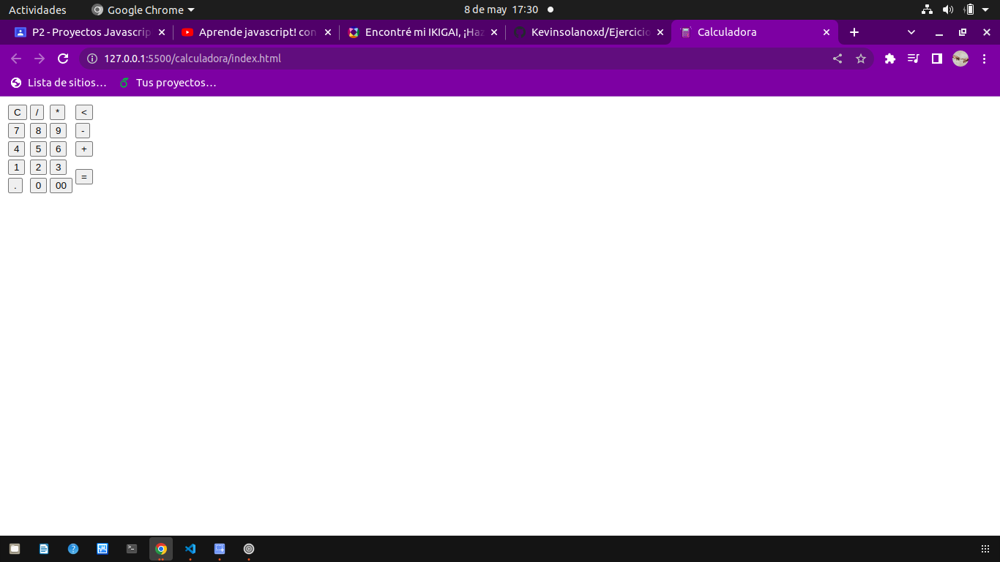
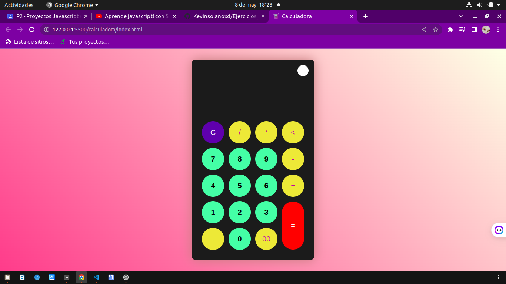
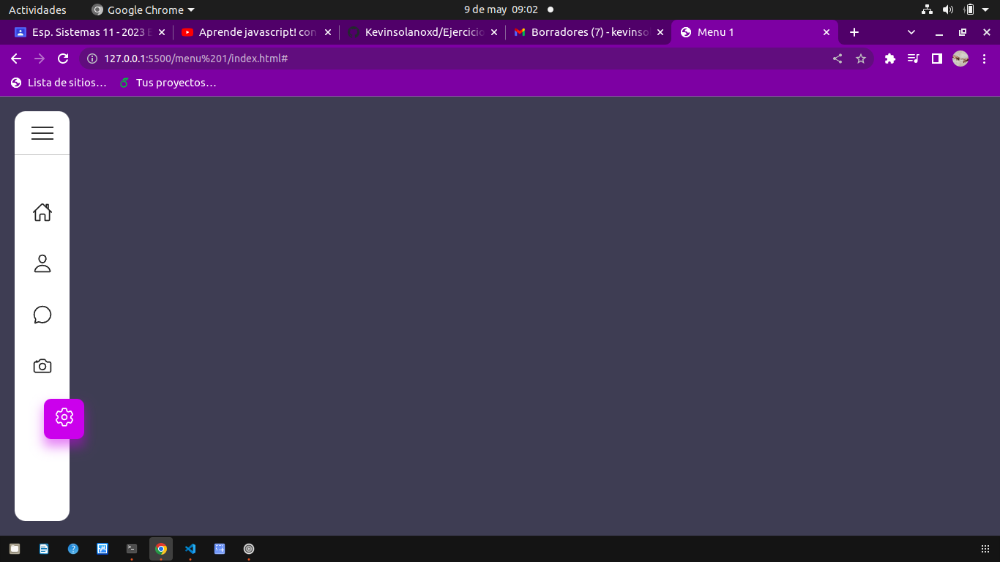
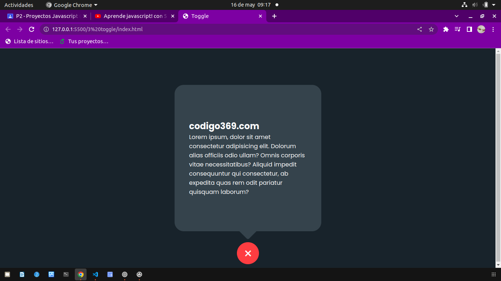
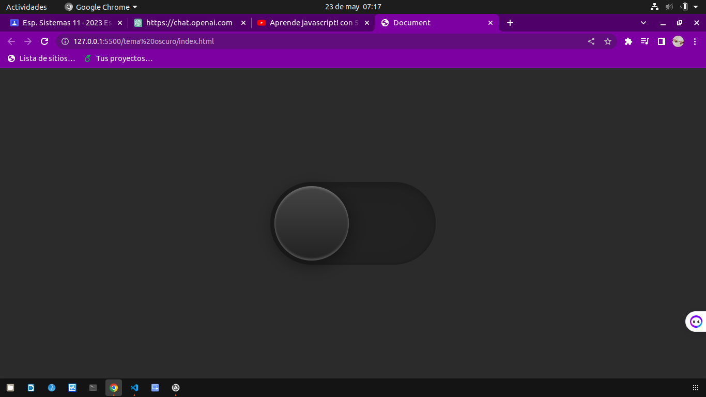
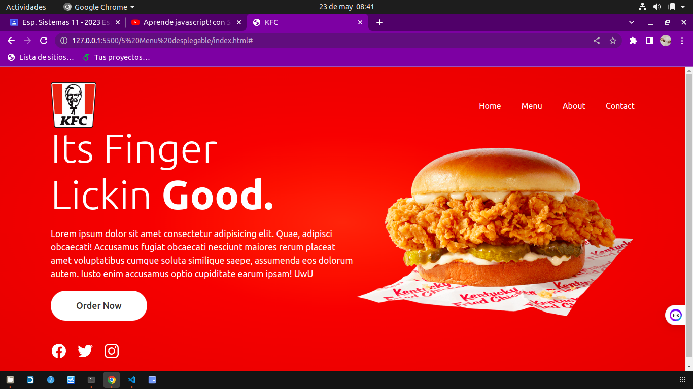
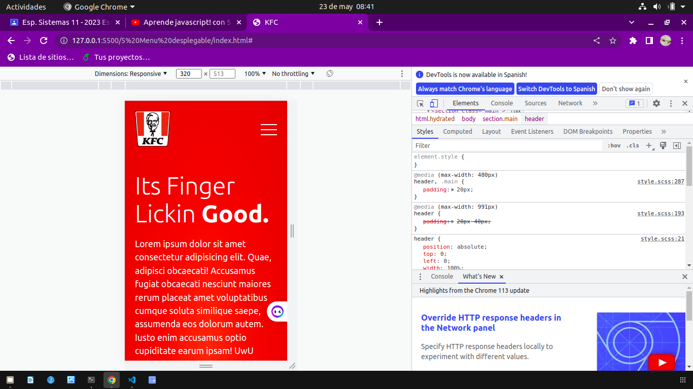

# Ejercicos de video js

# Primer ejercicio: Calculadora

### Este sitioes una calculadora como caulquier otra pero nos enseña como hacer que cambie de colores al precionar un boton y como personalizar los botones 

### Con tr y td podemos poner elemtos seguidos como colupnas y filas,  en el archivo script.js nos enseña como como identificar si se a echo clic en un coton y segun eso de haga una fucion  por ejemplo si se preciona el boton clear se limpie el display y que no aparesca nada al igual que con un boton 1 se ponga en e display el numero 1,  tambien pone algunos setTimeout para algunas ocaciones como al no poner nada y dar igual hacie hace con todos los botones para que cumplan su funcion de poner el respectivo texto o carecter, con display.innerText += item.id; hacemos que  los textos se acoplen al display y tambien que muestre el resultadoi de las operaciones, despues ponemos el css para que se vean mas llamativos los botones y con js y css hacemos que cambie de color de blanco a negro y agregamos mas css y listo 

### Añadimos el css

#
# Menu

### es un menu lateral con funcion de direccioanar a alguna pagina o alguna funcion o ventana 

### nos enseña como poner los links con algun icono por asi decirlo y ponerlo verticalmente, nos muestra en que pagina podemos poner los iconos y como ponerlos, en style.scss nos enseña como poner un Toggle donde que es para almacenar los links o vinculos puestos anterior mente tambien lo pone con bordes recortados para mejor estetica, despues nos enseña como poner por asi decirlo unas linias con &:: before que puso tres lineas con pocicion de y diferete, despues le quita los puntos con list-style: none; para que no se vean los punticos en la pantalla y arregla las dimanciones de los ul y li, despues que el texto se desplace hacia la derecha segun se inicie y cambia el color del icono y le pone color de fondo con una variable y el .icon{}, tambien hace que el texto sea visible por fuera del la barra y que el icono swa mas grande y tenga un cuadro al rededor configurando las dimenciones despues hace pone colores a todos para que sea bea mejor y pone que al activar se coloree la figura y las otras se mantengan opacas modifica el texto para que quede aliniado usando las dimenciones y con opacasi hace que los demas textos desaparescan y solo se vea el seleccionado, usando js para configurar los anterior mensionadas lineas  tengan un desplasamiento y formen una x y que tambien el rectangulo se alarge y muestre los nombres de los iconos usando constantes y funciones hace que tengan transiciones y funciones basicas que hacen su funcionamientro 

#
# Toggle

### esto nos enseña como hacer unn "activador" por asi decirlo que hace que halla un boton con una cruz  donde al precionarla se desplega un texto y a cruz se combierte en una x donde si se preciona dasaparece  el texto y la x se vuelve a combertir un una cruz. Para poder lograr hacer esto se uso una variable que tenga la caracteriztica de container donde el texto se mete dentro de un container, con la funcion toogle hace que un off pase a ser un on por asi decirlo  asi podemos hacer que el texto aparezca o desaparesca segun como demos click despues usa el css como vimos en los anteriores videos donde hace la x y la crus y hace una trancicion usando lo anterior mensionado 

#

# Tema oscuro

### Con el uso de css podemos crear un boton que pueda cambiar de color segun como se le de click en este caso al dar click el boton como la pantalla de torna de un color oscuro esto se da  gracias que por el uso de js porque podemos hacer que un codigo css se active y desactive con el uso de toggle y tambien con con el uso de las animaciones podemos hacer que tenga una trancicion del color blanco al negro con js se crean una variables con los toggles haciendo que cada tipo de toggle negro y blnaco cambien segun se de click es si esa es la funcion de este ejemplo simplemente es poner un boton que cuando se active todo cambie de color segun como querramos.

#

# Menu despegable

### Se establece un fondo degradado radial en el contenedor principal con colores rojos (#f0483a, #d10a20). El contenido se centra vertical y horizontalmente en el contenedor.

### Se define una cabecera con un logotipo y una barra de navegación que se posiciona en la parte superior de la página. La barra de navegación contiene enlaces representados por listas no ordenadas.

### Hay un contenido principal que consta de un título (h2), un párrafo (p) y un botón (btn). El contenido se muestra en forma de columna y se distribuye de manera uniforme en el espacio disponible.

### Se implementa un slider o carrusel de imágenes que muestra varias diapositivas. Cada diapositiva se representa con un elemento de imagen (img). Las diapositivas se ocultan o muestran según su estado activo.

### Se define un pie de página (footer) que se posiciona en la parte inferior de la página y contiene enlaces de redes sociales representados por listas no ordenadas.

### Se utilizan consultas de medios (@media) para aplicar estilos específicos en diferentes tamaños de pantalla. Los cambios incluyen ajustes en los márgenes, el tamaño del logotipo, el diseño del contenido, la visibilidad de la barra de navegación y la aparición de un menú desplegable en pantallas más pequeñas.

### En resumen, el código CSS proporcionado establece la apariencia visual y la disposición de los elementos en una página web, utilizando colores degradados, una estructura de cabecera y pie de página, y estilos responsivos para adaptarse a diferentes tamaños de pantalla.

## en el archivo styles.scss 

### El selector * aplica los siguientes estilos a todos los elementos: margen y padding se establecen en 0, el box-sizing se establece en border-box y la fuente se establece en "Ubuntu" con una fuente alternativa sans-serif.
### La clase .main estiliza el elemento contenedor principal. Establece el fondo como un degradado radial, centra su contenido vertical y horizontalmente y agrega padding.
### header estiliza el elemento de encabezado. Lo posiciona en la parte superior de la página, establece el padding y alinea el contenido.
### La clase .logo estiliza un elemento de logotipo, estableciendo el ancho máximo.
### La clase .navigation estiliza un elemento de navegación y sus elementos de lista y enlaces.
### La clase .content estiliza una sección de contenido con texto y un botón.
### La clase .text estiliza el texto dentro de la sección de contenido, incluyendo encabezados y párrafos.
### La clase .btn estiliza un elemento de botón.
### La clase .slider estiliza una sección de deslizador, incluyendo diapositivas e imágenes.
### La clase .footer estiliza una sección de pie de página en la parte inferior de la página.
### La clase .sci estiliza una lista de iconos de redes sociales.
### La clase .prevNext estiliza una sección de navegación anterior y siguiente.
### Se utilizan consultas de medios para aplicar diferentes estilos según el ancho de la pantalla. El código proporcionado incluye consultas de medios para anchos de pantalla de hasta 991px y 480px.

### en si esto es lo que hemos visto en los videos puestos donde nos enseñan todo esto tambien el archivo se hace los mismo quese visto en el anterir video donde crea por asi llamarlo variables donde se hace la funcion del evento de lo que pasa por dar click o pasar el maus sobre el icono 

## menu comprimido para celulares 
