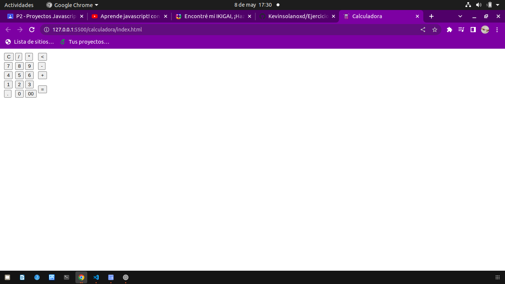
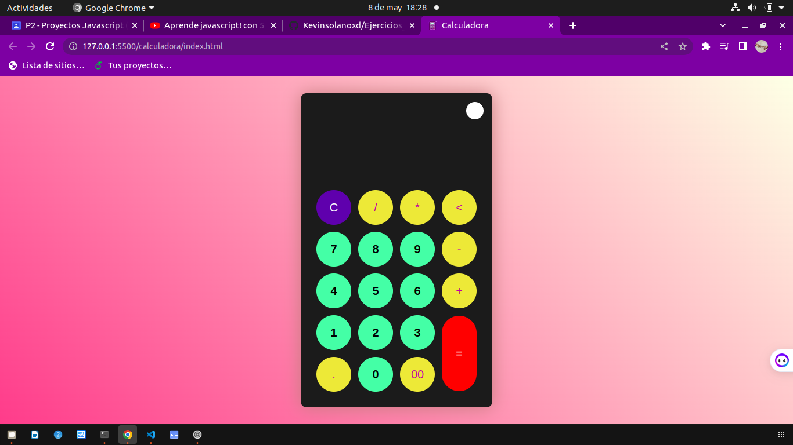

# Ejercicos de video js

## Primer ejercicio: Calculadora

### Este sitioes una calculadora como caulquier otra pero nos enseña como hacer que cambie de colores al precionar un boton y como personalizar los botones 

### Con tr y td podemos poner elemtos seguidos como colupnas y filas,  en el archivo script.js nos enseña como como identificar si se a echo clic en un coton y segun eso de haga una fucion  por ejemplo si se preciona el boton clear se limpie el display y que no aparesca nada al igual que con un boton 1 se ponga en e display el numero 1,  tambien pone algunos setTimeout para algunas ocaciones como al no poner nada y dar igual hacie hace con todos los botones para que cumplan su funcion de poner el respectivo texto o carecter, con display.innerText += item.id; hacemos que  los textos se acoplen al display y tambien que muestre el resultadoi de las operaciones, despues ponemos el css para que se vean mas llamativos los botones y con js y css hacemos que cambie de color de blanco a negro y agregamos mas css y listo 

### Añadimos el css

## Menu

### es un menu lateral con funcion de direccioanar a alguna pagina o alguna funcion o ventana 

### nos enseña como poner los links con algun icono por asi decirlo y ponerlo verticalmente, nos muestra en que pagina podemos poner los iconos y como ponerlos, en style.scss nos enseña como poner un Toggle donde que es para almacenar los links o vinculos puestos anterior mente tambien lo pone con bordes recortados para mejor estetica, despues nos enseña como poner por asi decirlo unas linias con &:: before que puso tres lineas con pocicion de y diferete, despues le quita los puntos con list-style: none; para que no se vean los punticos en la pantalla y arregla las dimanciones de los ul y li, despues que el texto se desplace hacia la derecha segun se inicie y cambia el color del icono y le pone color de fondo con una variable y el .icon{}, tambien hace que el texto sea visible por fuera del la barra y que el icono swa mas grande y tenga un cuadro al rededor configurando las dimenciones despues hace pone colores a todos para que sea bea mejor y pone que al activar se coloree la figura y las otras se mantengan opacas modifica el texto para que quede aliniado usando las dimenciones y con opacasi hace que los demas textos desaparescan y solo se vea el seleccionado, usando js para configurar los anterior mensionadas lineas  tengan un desplasamiento y formen una x y que tambien el rectangulo se alarge y muestre los nombres de los iconos usando constantes y funciones hace que tengan transiciones y funciones basicas que hacen su funcionamientro 

